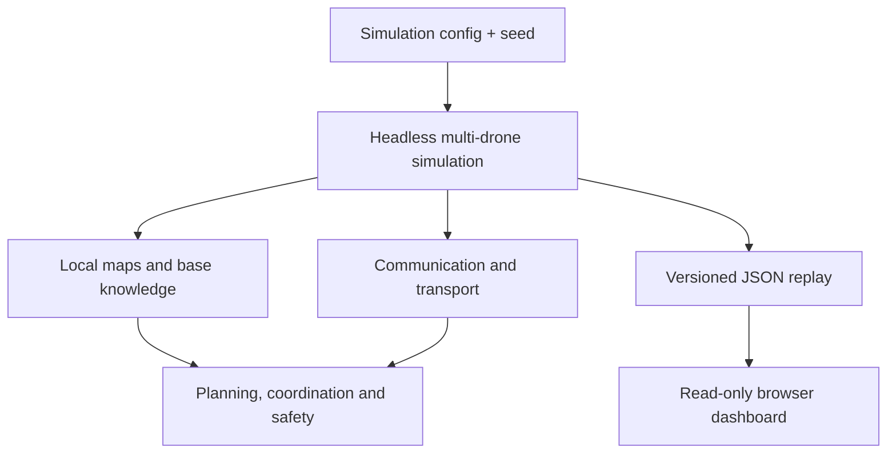

# EchoRescue

**A deterministic research simulation for robust multi-drone search and rescue under partial knowledge, limited communication, and network failures.**

Two autonomous drones explore an initially unknown, GPS-denied floor, build occupancy maps, confirm survivors, avoid collisions, exchange knowledge when links permit, and return safely to base. Every mission can be replayed and benchmarked from a seed.

> EchoRescue is a software simulation. Its results do not demonstrate real-world flight safety or hardware readiness.

## Mission replay


<details>
<summary>Watch the final mission phase and safe return of both drones</summary>


</details>

## Research focus

EchoRescue investigates one central question:

> How robustly can multiple autonomous drones search an unknown environment when their maps are incomplete, communication is intermittent, and energy is limited?

The project is intentionally more than an animation. Planning runs headlessly; the browser only renders versioned replay data. Ground truth remains separate from operator-visible knowledge, and all published performance claims point to reproducible JSON artifacts.

## Verified results

### Two drones versus one drone

The baseline suite uses seeds 0–49 within one documented scenario family: a 21 × 13 grid, obstacle density 0.08, three stationary survivors, noise-free cardinal sensing, and fixed energy parameters. Every two-drone run is repeated for determinism.

| Metric | Single drone | Two drones |
| --- | ---: | ---: |
| Mean mission duration | 121.52 steps | 72.10 steps |
| Mission-duration range | 108–142 | 59–102 |
| Successful missions | 50/50 | 50/50 |
| Survivor recall | 100% | 100% |
| Wall collisions | 0 | 0 |
| Drone collisions | n/a | 0 |
| Mean path length | 121.52 cells | 134.64 cells combined |
| Duplicate exploration | n/a | 12.56% |

Within this benchmark suite, two drones reduced mean mission duration by **40.67%** while increasing combined path length by **10.80%**. These results establish a reproducible baseline for this scenario family; they are not a claim of performance across arbitrary buildings or real-world conditions.

Source: [`benchmarks/two_drone_50_seeds.json`](benchmarks/two_drone_50_seeds.json)

### Partial knowledge and constrained communication

| Experiment | Main result | Observed cost or limitation |
| --- | --- | --- |
| Active Local Knowledge | 50/50 successful missions, 100% base-known survivor recall, zero collisions | 75.30 mean steps versus 72.10 in Shared mode; 4,176 local replans across the suite |
| Local-map Shadow Mode | All 50 missions reconverged; 26.07% mean peak map divergence | Shadow maps are observational and do not affect decisions |
| Adaptive Relay | Communication uptime increased from 32.94% to 34.33% | Mission duration increased by 3.48%; the strategy remains opt-in |
| Constrained transport, Relay off | 50/50 successful missions and zero collisions at 5% deterministic packet loss | 152.64 mean steps; 65.11% logical-message completion |
| Constrained transport, Adaptive Relay | 50/50 successful missions and zero collisions | 160.26 mean steps and lower 63.03% logical-message completion; not accepted as an improvement |

The constrained-network results are useful precisely because the Relay strategy does **not** win: under the current transport model it creates more traffic and delays completion. EchoRescue keeps this negative result visible instead of promoting the strategy to a default.

Reproducible artifacts:

- [`benchmarks/knowledge_modes_50_seeds.json`](benchmarks/knowledge_modes_50_seeds.json)
- [`benchmarks/shadow_mode_50_seeds.json`](benchmarks/shadow_mode_50_seeds.json)
- [`benchmarks/adaptive_relay_50_seeds.json`](benchmarks/adaptive_relay_50_seeds.json)
- [`benchmarks/constrained_network_50_seeds.json`](benchmarks/constrained_network_50_seeds.json)

## System architecture



The main design boundary is one-way: the dashboard never maps cells, assigns frontiers, plans paths, detects survivors, accounts for energy, or chooses movements. It renders decisions that the deterministic simulation already made.

Core capabilities published on `master` include:

- procedural seeded 2D grid environments with separate ground truth
- local sensing, occupancy mapping, frontier exploration, and A* planning
- survivor detection with two-observation confirmation
- deterministic energy accounting and independent return-to-base behavior
- two-drone frontier allocation and collision avoidance
- line-of-sight radio graphs with direct, peer-relay, and disconnected states
- Shared, Shadow, and Active Local knowledge modes
- distributed motion-intent reservations plus a final simulator safety shield
- opt-in Adaptive Relay behavior
- opt-in deterministic latency, loss, bandwidth, fragmentation, TTL, retry, priority, and Final Sync modeling
- versioned telemetry, JSON mission reports, replay validation, and an interactive dashboard

### Knowledge modes

| Mode | Decision knowledge | Purpose |
| --- | --- | --- |
| `shared` | One shared occupancy map | Stable centralized baseline and default behavior |
| `shadow` | Shared decisions plus observational local maps | Measure divergence and synchronization without changing control |
| `local` | Each drone plans from its own map | Test coordination under partial knowledge and disconnection |

In Active Local mode, the global map exists only for evaluation and rendering. Cells and confirmed-survivor records move between drones and the base only through the current communication component. The central movement resolver remains as a last-resort simulation safety shield; this is containment, not a proof of decentralized collision avoidance.

## Quick start

Python 3.10 or newer is required. The runtime and dashboard use only the Python standard library.

```bash
git clone https://github.com/oleszik/ECHORESCUE.git
cd ECHORESCUE
python -m pip install -e .

python -m echorescue \
  --drones 2 \
  --seed 7 \
  --replay-out replays/seed_7.json

python -m echorescue.dashboard --replay replays/seed_7.json
```

Open <http://127.0.0.1:8000>. The dashboard provides playback and timeline scrubbing, drone trails and planned paths, battery and state telemetry, survivor events, coverage, communication links, local/base knowledge views, and final mission metrics.

Try the communication-aware modes:

```bash
# Local planning with communication-dependent knowledge exchange
python -m echorescue --drones 2 --seed 7 \
  --knowledge-mode local \
  --replay-out replays/seed_7_local.json

# Opt-in Adaptive Relay
python -m echorescue --drones 2 --seed 7 \
  --knowledge-mode local \
  --relay-strategy adaptive \
  --replay-out replays/seed_7_relay.json

# Opt-in constrained network transport
python -m echorescue --drones 2 --seed 7 \
  --knowledge-mode local \
  --network-profile constrained \
  --replay-out replays/seed_7_constrained.json
```

Use `python -m echorescue --help` for map, sensing, energy, communication, and transport parameters.

## Reproduce the experiments

```bash
python -m echorescue.benchmark \
  --seeds 50 \
  --output benchmarks/two_drone_50_seeds.json

python -m echorescue.knowledge_benchmark \
  --seeds 50 \
  --output benchmarks/knowledge_modes_50_seeds.json

python -m echorescue.relay_benchmark \
  --seeds 50 \
  --output benchmarks/adaptive_relay_50_seeds.json

python -m echorescue.network_benchmark \
  --seeds 50 \
  --output benchmarks/constrained_network_50_seeds.json
```

Additional benchmark entry points cover communication telemetry, Shadow Mode, and distributed deconfliction. The committed artifacts include their exact configuration, seed range, determinism status, aggregate metrics, and—in the newer suites—per-seed outcomes.

## Verification

```bash
python -m unittest discover -s tests -v
python -m compileall -q src tests
```

The test suite covers environment generation, sensing and occlusion, mapping, A* planning, survivor confirmation, energy safety, communication and synchronization, deterministic multi-drone coordination, collision avoidance, constrained transport, replay fidelity, hidden-state protection, dashboard assets, and an HTTP smoke test.

## Project status

| Status | Scope |
| --- | --- |
| **Implemented on `master`** | Deterministic 2D simulation, mapping, planning, two-drone coordination, energy/RTB, replay dashboard, communication graph, local knowledge, deconfliction, Adaptive Relay, constrained transport |
| **Experimental and opt-in** | Active Local Knowledge, Adaptive Relay, constrained network profile |
| **Next validation milestone** | Diversified scenario matrix, distribution statistics, explicit failure cases, and feature ablations |
| **Future work — not implemented on `master`** | Failure injection and reassignment, uncertain multisensor perception, dynamic obstacles, multiple floors, ROS 2, MAVLink/ArduPilot SITL, and hardware experiments |

The project is currently a reproducible **simulation research baseline**. The next priority is broader validation rather than adding every possible robotics feature.

## Current limitations

- Published 50-seed claims come from documented but narrow scenario families, not a diversified building matrix.
- The environment is one static 2D floor with at most two drones and stationary survivors.
- Geometry, motion, sensing, and energy are abstract grid models; sensing is cardinal and noise-free.
- The ideal network profile exchanges data instantaneously; the constrained profile adds deterministic transport effects but is not a complete network protocol.
- Active Local mode retains a central simulator safety shield as a final fail-safe.
- Adaptive Relay uses two drones and a local deterministic heuristic; it is neither learned nor globally optimal.
- Replays favor transparent full snapshots over storage efficiency.
- There is no ROS 2, MAVLink, ArduPilot, 3D, or real-hardware integration on the published branch.

## Validation roadmap

1. **Scenario diversification** — vary map size, obstacle density, bottlenecks, survivor placement, base location, radio conditions, and energy margins.
2. **Statistical reporting** — publish median, IQR or standard deviation, min/max, and classified failure counts alongside means.
3. **Ablation studies** — isolate the contribution and cost of local knowledge, deconfliction, Relay behavior, and transport hardening.
4. **Failure robustness** — introduce explicit drone/component failures and measure reassignment quality.
5. **Uncertain perception** — evaluate a narrowly scoped multisensor question with confidence and conflicting observations.
6. **Optional integration anchor** — only after the simulation baseline is stable, test a minimal planner-to-MAVLink/ArduPilot SITL command path.

## Scope and licensing

EchoRescue is intended for civilian search-and-rescue research, engineering evaluation, and portfolio demonstration. It contains no pursuit, targeting, weapon, or attack functionality.

Copyright © 2026 Ole Sendzik. **All rights reserved.** Public visibility does not grant permission to copy, modify, distribute, sublicense, sell, commercially exploit, or incorporate the code into another project. See [`LICENSE`](LICENSE) for the full terms.
