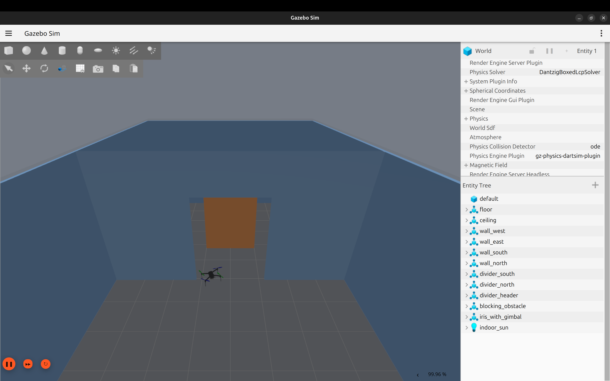
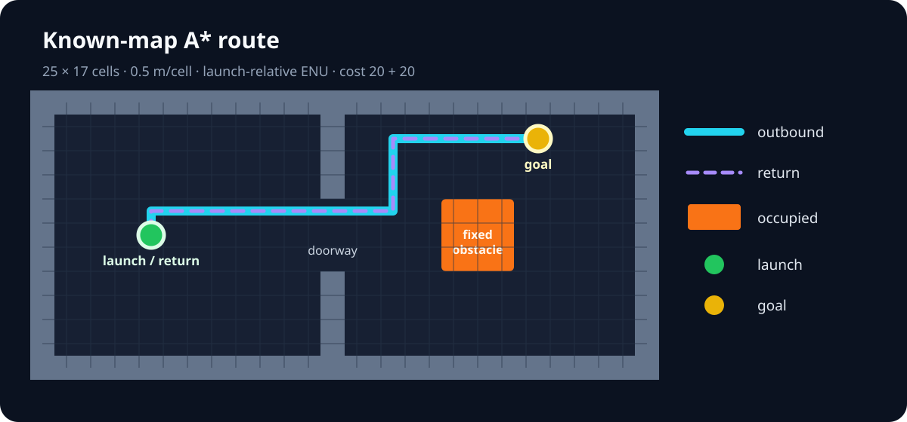

# EchoRescue

[](https://github.com/oleszik/ECHORESCUE/actions/workflows/tests.yml)
[](pyproject.toml)
[](docs/v0.15.0-planner-flight-bridge.md)
[](docs/v0.14-3d-integration-baseline.md)
[](LICENSE)

EchoRescue is a deterministic search-and-rescue simulation platform. It combines
grid exploration and coordination experiments with a simulation-only flight
stack built from ROS 2, ArduPilot SITL and Gazebo. Its current end-to-end
milestone plans a collision-free route through a known indoor map, flies it to
the goal and back, and verifies landing with independent telemetry and Gazebo
evidence.



> Simulation only. EchoRescue is research and engineering software, not evidence
> of real-aircraft safety.

## What already works?

- Deterministic single- and multi-agent grid missions with versioned replays.
- A* planning, occupancy maps, frontier allocation and energy-safe return.
- Smoke, noisy Visual/Thermal perception, dynamic closures, failure recovery,
  constrained communication, Relay experiments and discrete multi-floor maps.
- A read-only browser dashboard for inspecting recorded missions.
- Typed ROS 2 telemetry from ArduPilot and explicit NED/FRD to ENU/FLU state.
- ACK-and-telemetry-gated GUIDED, arm, takeoff, hover, LAND and disarm control.
- Continuous local-ENU waypoint execution with progress, arrival and settling
  checks plus bounded landing recovery.
- A reproducible two-room Gazebo world with doorway, obstacle, contact sensors
  and independent clearance evaluation.
- Known-map A* planning of both outbound and return flight routes.

## Current system architecture

```text
Repository-owned known occupancy map
               │
               ▼
   deterministic cardinal A* ──► checked grid-to-ENU adapter
                                           │
                                           ▼
                                  generated flight targets
                                           │
ArduPilot telemetry ──► typed ROS state ──► waypoint mission controller
       ▲                                   │
       └──────── MAVLink commands ─────────┘

Gazebo world pose + contact topics ──► independent evaluator ──► JSON evidence
                                                        (never control input)
```

The flight controller uses only configuration, planner output and independently
observed vehicle telemetry. Gazebo ground truth is confined to evaluation. The
legacy telemetry bridge remains receive-only. See the
[architecture decisions](docs/adr/README.md), especially
[ADR 0020](docs/adr/0020-telemetry-control-gazebo-evaluation-separation.md) and
[ADR 0021](docs/adr/0021-known-map-grid-to-enu-planning-boundary.md).

## Visible demonstrations

### Planner-generated indoor flight

The real v0.15.0 owned-stack mission launches Gazebo, ArduPilot SITL, the ROS 2
mission node, independent observer and evaluator. The Iris crosses the doorway,
flies around the blocker, reaches the second room, returns and lands.

### Known-map route

The accepted route is generated from the versioned occupancy map. Walls and the
fixed blocker are inflated using the conservative vehicle radius and safety
margin before the existing deterministic A* runs.



### Deterministic multi-agent replay

The browser dashboard visualizes recorded grid missions without participating
in mission decisions. This is a discrete multi-agent simulation—not a
multi-drone Gazebo capability.

[](https://oleszik.github.io/ECHORESCUE/)

## Verified results

All linked flight reports are committed, machine-readable acceptance evidence.

| Capability | Evidence |
| --- | --- |
| Real Gazebo/ArduPilot arm–takeoff–hover–land | [v0.14.3 owned-stack smoke report](artifacts/v0.14.3-flight-smoke-owned.json) |
| Continuous waypoint navigation | [v0.14.4 owned-stack smoke report](artifacts/v0.14.4-waypoint-smoke-owned.json) |
| Indoor world and collision evaluation | [v0.14.5 graphical](artifacts/v0.14.5-indoor-graphical-owned.json), [headless](artifacts/v0.14.5-indoor-headless-owned.json), [collision negative](artifacts/v0.14.5-indoor-negative-collision.json) |
| A* planning to the goal and back | [v0.15.0 graphical](artifacts/v0.15.0-planner-flight-graphical.json), [headless](artifacts/v0.15.0-planner-flight-headless.json), [blocked goal](artifacts/v0.15.0-blocked-goal.json), [unsafe clearance](artifacts/v0.15.0-unsafe-clearance.json) |
| Sensor discovery and bounded replanning | [v0.15.1 graphical](artifacts/v0.15.1-sensor-replanning-graphical.json), [headless](artifacts/v0.15.1-sensor-replanning-headless.json), [unreachable recovery](artifacts/v0.15.1-unreachable-after-discovery.json) |
| Automated regression tests | [CI workflow](https://github.com/oleszik/ECHORESCUE/actions/workflows/tests.yml) · 504 Python tests and 13 native ROS tests at v0.15.1 acceptance |
| Safe cleanup | Owned-process, ROS-node and UDP 9002/14550 plus TCP 5760 checks in the linked smoke reports |

In both accepted v0.15.0 runs, the mission and independent observer agreed on
GUIDED, armed takeoff, all nine planner-generated targets, LAND, `ON_GROUND`,
disarm and one unchanged telemetry session. The Gazebo evaluator confirmed both
doorway crossings, goal and return-region entry, required clearance and no
prohibited contact.

## Quick start

The deterministic core requires Python 3.10 or newer and has no third-party
runtime dependencies:

```bash
python -m pip install -e .
python -m echorescue --drones 4 --seed 44
python -m echorescue.dashboard
```

Open <http://127.0.0.1:8000>, or use the
[public dashboard](https://oleszik.github.io/ECHORESCUE/).

The real 3D stack additionally requires Ubuntu, ROS 2 Jazzy, Gazebo Harmonic,
the pinned ArduPilot/ArduPilot-Gazebo revisions and the documented simulator
environment. After completing the
[3D setup](docs/v0.14-3d-integration-baseline.md):

```bash
source /opt/ros/jazzy/setup.bash
source .venv-sim/bin/activate
source ros2_ws/install/setup.bash

./scripts/run_planner_flight_integration.sh diagnose
./scripts/run_planner_flight_integration.sh \
  --output artifacts/v0.15.0-planner-flight-headless.json \
  smoke --timeout 260
```

Use the exact graphical command and pinned environment from the
[v0.15.0 reproduction guide](docs/v0.15.0-planner-flight-bridge.md).

## Reproducible tests

Run the same Python checks as CI:

```bash
python -m pip install -e ".[dev]"
python -m pytest
python -m mypy src
python -m compileall -q src tests
```

With the Jazzy environment sourced, build and test the ROS workspace:

```bash
python -m colcon --log-base ros2_ws/log build \
  --symlink-install --base-paths ros2_ws/src \
  --build-base ros2_ws/build --install-base ros2_ws/install
source ros2_ws/install/setup.bash
python -m colcon --log-base ros2_ws/log test \
  --base-paths ros2_ws/src \
  --build-base ros2_ws/build --install-base ros2_ws/install
python -m pytest -q ros2_ws/src/echorescue_ros/test
```

Benchmark commands and experiment-specific reproduction notes remain in
[`docs/`](docs/) and [`benchmarks/`](benchmarks/).

## Known limitations

- All vehicle-control results are simulation-only; there is no HIL or real
  aircraft support.
- The flown indoor route uses one static, repository-authored 2D known map and
  one fixed cruise altitude.
- There is no SLAM, map discovery, obstacle perception, dynamic in-flight
  replanning or generalized 3D planning.
- Gazebo flight is currently single-vehicle and single-level. Multi-agent and
  multi-floor capabilities belong to the deterministic grid simulator.
- Visual and Thermal sensors, smoke, radio propagation and failures are
  abstract experimental models rather than physical sensor or RF models.
- The built-in dashboard server is intended for demonstrations and development,
  not hardened production hosting.

See the detailed limitations in each milestone document before interpreting
results beyond its declared scope.

## Milestones and documentation

| Milestone | Delivered capability | Details |
| --- | --- | --- |
| v0.1–v0.5 | Deterministic exploration, coordination, telemetry, dashboard and portfolio hardening | [`docs/`](docs/) |
| v0.6–v0.11 | N-agent scaling, uncertainty studies, dynamic closures, roles, Relay and discrete multi-floor experiments | [`docs/`](docs/) |
| v0.12 | Probabilistic mapping and uncertainty-aware planning study | [Documentation](docs/v0.12-uncertain-perception.md) |
| v0.13 | Typed ROS 2 closed-loop bridge for the discrete simulator | [Documentation](docs/v0.13-ros2-bridge.md) |
| v0.14.0–v0.14.2 | Pinned 3D stack, receive-only MAVLink and continuous ENU state | [3D baseline](docs/v0.14-3d-integration-baseline.md) · [Telemetry](docs/v0.14.1-mavlink-telemetry-bridge.md) · [Frames](docs/v0.14.2-coordinate-frames.md) |
| v0.14.3 | Closed-loop arm, takeoff, hover and land | [Documentation](docs/v0.14.3-flight-milestone.md) |
| v0.14.4 | Continuous local waypoint navigation | [Documentation](docs/v0.14.4-waypoint-navigation.md) |
| v0.14.5 | Reproducible indoor world and collision evaluation | [Documentation](docs/v0.14.5-indoor-reference-world.md) |
| v0.15.0 | Known-map A* route generation connected to real simulated flight | [Documentation](docs/v0.15.0-planner-flight-bridge.md) |
| v0.15.1 | Range-sensor obstacle discovery and bounded A* replanning | [Documentation](docs/v0.15.1-sensor-replanning.md) |

Development currently stops at the v0.15.1 simulation-only sensor-replanning
boundary. The complete roadmap, benchmark interpretation, setup guides and ADRs
live in [`docs/`](docs/).

## Scope and licensing

EchoRescue is intended for civilian search-and-rescue research, engineering
evaluation and portfolio demonstration. It contains no pursuit, targeting,
weapon or attack functionality.

Copyright © 2026 Ole Sendzik. **All rights reserved.** Public visibility does
not grant permission to copy, modify, distribute, sublicense, sell,
commercially exploit or incorporate the code into another project. See
[`LICENSE`](LICENSE) for the full terms.
