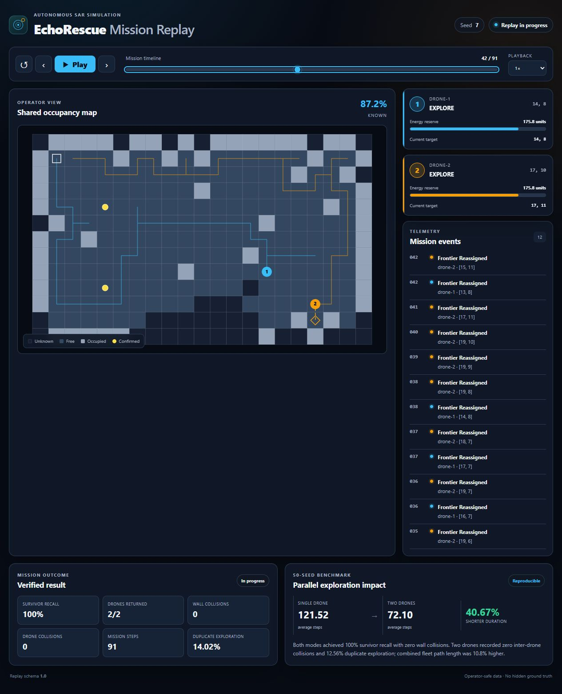
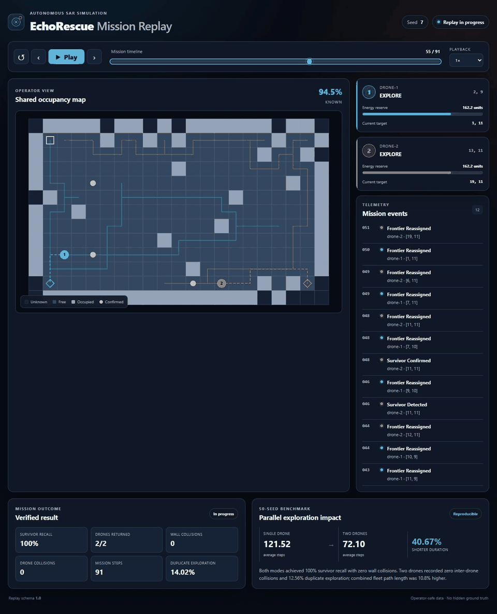

# EchoRescue

EchoRescue is a deterministic, grid-based search-and-rescue simulation with a
browser replay dashboard. Two drones explore an initially unknown floor, share
an occupancy map, confirm survivors, and return independently to base. Mission
decisions remain headless; the dashboard only renders a versioned replay.

## Mission replay



<details>
<summary>Watch the final mission phase through the safe return of both drones</summary>



</details>

## Quick start

Python 3.10 or newer is required. The runtime and dashboard have no third-party
dependencies.

```bash
python -m pip install -e .
python -m echorescue --drones 2 --seed 7 --replay-out replays/seed_7.json
python -m echorescue.dashboard --replay replays/seed_7.json
```

Open <http://127.0.0.1:8000>. The dashboard provides playback, single-step
navigation, click/drag timeline scrubbing, 0.25× through 8× speed, drone trails,
planned paths, battery and state telemetry, confirmed survivors, event history,
coverage, direct and relay radio links, communication state, final metrics, and
the verified single-/two-drone comparison.

To reproduce the benchmark artifact:

```bash
python -m echorescue.benchmark --seeds 50 --output benchmarks/two_drone_50_seeds.json
python -m echorescue.communication_benchmark --seeds 50 --output benchmarks/communication_50_seeds.json
```

The server automatically loads that default benchmark file when it exists. A
different artifact can be selected explicitly:

```bash
python -m echorescue.dashboard --replay replays/seed_7.json --benchmark benchmarks/two_drone_50_seeds.json
```

## Architecture

Simulation and presentation have a one-way boundary:

```text
SimulationConfig + seed
          |
          v
 MultiDroneSimulation  --> JSON result
          |
    read-only observer
          v
 versioned replay JSON --> local HTTP server --> HTML/CSS/Canvas dashboard
```

The browser does not generate maps, plan paths, assign frontiers, detect
survivors, account for energy, or decide movements. Each replay frame is a
snapshot of the simulation's already-computed operator-visible state. It
contains both drone states, batteries, targets and paths; the known occupancy
map; confirmed survivors; coverage; communication graph; and the events emitted
at that step. The deterministic radio graph is observational only: navigation,
mapping, target allocation, and mission decisions do not consume it.

Ground truth and discovered knowledge remain separate. Standard replays never
contain the full wall set, unconfirmed survivor positions, or a ground-truth
map. Unknown cells stay unknown until the simulation's sensors map them.
Unconfirmed survivor observations remain per drone; only shared confirmations
are exposed in the replay.

### Communication telemetry

The base station is a separate graph node at the base cell. At frame zero and
after every simulation step, radio links are recomputed from the configured
Euclidean range and a conservative grid line-of-sight test: an intervening wall
blocks the link. A drone is classified as direct, connected through the other
drone, or disconnected. Transition events are emitted only when that state
changes.

Uptime values are connected frame samples divided by all frame samples,
including frame zero. Relay uptime counts only samples where no direct base link
exists and a peer path does; outage length is the number of consecutive
disconnected samples. The reproducible 50-seed artifact is available at
[`benchmarks/communication_50_seeds.json`](benchmarks/communication_50_seeds.json).

Replay schema `1.1` intentionally stores full known-map snapshots per frame.
This is simple, deterministic, and easy to audit. The checked-in Seed 7 replay
is approximately 230 KB; future large maps may benefit from delta encoding.

## Verified benchmark

[`benchmarks/two_drone_50_seeds.json`](benchmarks/two_drone_50_seeds.json) is
machine-generated from seeds 0–49. Every two-drone seed is executed twice for a
determinism check, alongside the existing single-drone baseline.

| Metric | Single drone | Two drones |
| --- | ---: | ---: |
| Average mission duration | 121.52 steps | 72.10 steps |
| Survivor recall | 100% | 100% |
| Wall collisions | 0 | 0 |
| Drone collisions | n/a | 0 |
| Duplicate exploration | n/a | 12.56% |

The reported **40.67% shorter mission duration** is calculated as
`(121.52 - 72.10) / 121.52 × 100`, rounded to two decimals. All 50 two-drone
missions returned both drones, with no failures or timeouts. The trade-off is
explicit: combined fleet path length averaged 134.64 cells versus 121.52 for
one drone, an increase of about 10.8%.

## Simulation controls

For a headless JSON summary without a replay:

```bash
python -m echorescue --seed 7 --drones 2
```

The deterministic model exposes sensor, survivor, battery, reserve, wait-cost,
radio-range, map-size, obstacle-density and maximum-step options through
`--help`. Use
`--drones 1` for the preserved single-drone regression mode and `--start-mode
shared-base` for two virtual launch slots at the base.

## Verification

```bash
python -m unittest discover -s tests -v
python -m compileall -q src tests
```

The suite covers seeded generation, sensing and occlusion, mapping, A* planning,
survivor, energy, and communication events, return safety, deterministic
multi-drone coordination, collision avoidance, replay determinism, hidden-state protection,
event/metric fidelity, dashboard assets, and a local HTTP smoke test.

## Current limitations

- one static 2D floor and at most two drones
- cardinal, noise-free sensing and abstract deterministic energy units
- replay schema compatibility is version-checked but has no migration layer
- full occupancy snapshots favor transparency over file-size efficiency
- the local server is intended for development and portfolio demos, not public
  production hosting
- the dashboard is desktop-first; it remains usable at narrow widths but has no
  touch-specific gestures beyond the native range control
- communication is deterministic range/line-of-sight telemetry only; there is
  no delayed map synchronization, relay role, or behavior adaptation
- no roles, injected failures, dynamic obstacles, ROS 2, hardware integration,
  or 3D visualization

This is a software simulation and not evidence of real-world flight safety.
