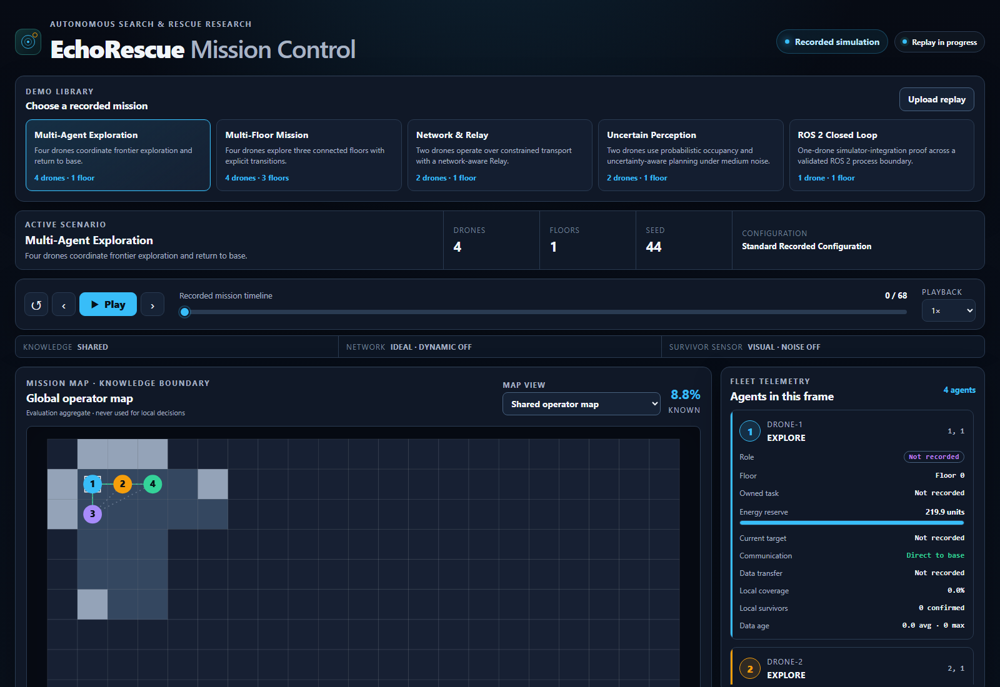

# EchoRescue

[](https://github.com/oleszik/ECHORESCUE/actions/workflows/tests.yml)
[](pyproject.toml)
[](LICENSE)

EchoRescue is a deterministic, grid-based search-and-rescue simulator for
studying how autonomous agents explore an unknown environment, coordinate over
imperfect communication, confirm Survivors, recover from failures, and return
safely to base.


The simulation core is headless and dependency-free. A browser dashboard
replays its versioned, operator-safe telemetry without participating in mission
decisions.

## Verified results

Every result below comes from a committed JSON artifact and can be regenerated
with the documented benchmark commands.

| Experiment | Stored result over 50 seeds |
| --- | --- |
| Probabilistic perception / v0.12 | 160 paired runs: success 100/70/25/0% from clean to high noise for both planners; clean entropy-proxy duration -10.8 steps, high-noise Recall -18.3 points versus naive |
| Multi-floor / 2.5D | 4 agents across 3 floors: 50/50 success, full Recall/return, zero collisions; 13.28 transitions and 1.40 safely resolved conflicts per mission |
| Predictive communication / Multi-Relay | 4 agents: reactive two-vs-one Relay uptime +5.09 points; predictive-vs-reactive +2.38 points; all 150 Relay missions successful with full Recall/return and zero collisions |
| Generalized roles + failure resilience | 4 agents: 50/50 failure tasks reassigned, 100% mission success/Recall/operational return, 1-step execution recovery, zero collisions and Role Thrashing |
| Dynamic obstacles | Paired Moderate vs Off: +2.92 steps (+4.28%) and +5.60 path cells (+4.32%); 49/49 replans successful, 50/50 missions successful, zero collisions |
| Noisy Survivor perception | Visual/moderate: 96.67% Recall, 90% mission success, 7.98% FPR, 18.22% FNR; 100/100 agents returned and zero collisions |
| N-agent scaling | 1/2/4/8-agent fleets: 200/200 successful and collision-free missions; mean duration 121.52/72.10/65.36/62.04 steps |
| Two-agent search | 50/50 successful missions, 100% Survivor Recall, both drones returned, zero wall/drone collisions; 40.67% shorter mean duration than one drone |
| Failure reassignment | 50/50 injected failures recovered, 50/50 released tasks reassigned, 100% Recall, zero collisions |
| Constrained communication | 100% base-known Recall and mission success for Relay-off and Adaptive Relay, zero collisions and Final-Sync timeouts |
| Visual perception under moderate Smoke | Recall falls from 100% to 79.33%; navigation and collision metrics remain unchanged |
| Isolated Thermal perception under moderate Smoke | 96.67% Recall; 22 of 25 incomplete Visual-Smoke seeds recovered, zero collisions |

The headline mission comparison is stored in
[`benchmarks/two_drone_50_seeds.json`](benchmarks/two_drone_50_seeds.json).
Failure, network, Smoke, Thermal, knowledge, deconfliction, and Relay artifacts
are available in [`benchmarks/`](benchmarks/). Experiment-specific analysis is
documented in [`docs/`](docs/).
The N-agent results, variance, efficiency, and per-seed regressions are analyzed
in [`docs/v0.6-n-agent-scaling.md`](docs/v0.6-n-agent-scaling.md).
The confidence model, holdout results, reliability analysis, and failure seeds
are in
[`docs/v0.7-noisy-perception-confidence.md`](docs/v0.7-noisy-perception-confidence.md).
The dynamic-closure model, paired holdout, failure analysis, and replanning
costs are in
[`docs/v0.8-dynamic-obstacles-replanning.md`](docs/v0.8-dynamic-obstacles-replanning.md).
The N-agent role/task model, paired failure holdout, recovery latencies, and
Generalist comparison are in
[`docs/v0.9-generalized-roles-failure-resilience.md`](docs/v0.9-generalized-roles-failure-resilience.md).
The N-agent Relay topology, planned-path forecast, paired holdout costs, and
per-seed limitations are in
[`docs/v0.10-predictive-communication-multi-relay.md`](docs/v0.10-predictive-communication-multi-relay.md).
The discrete floor graph, transition deconfliction, Floor allocation, vertical
overhead, and scaling results are in
[`docs/v0.11-multi-floor-2.5d.md`](docs/v0.11-multi-floor-2.5d.md).

## v0.12: Uncertain perception and probabilistic mapping

Probabilistic perception is opt-in. Bounded occupancy log odds, provenance-aware
idempotent fusion, simulation-time decay, and separate Survivor evidence use the
existing mapping/sensor/transport interfaces. Compare `naive` and
`uncertainty-aware` planning on the same probability map:

```bash
python -m echorescue --drones 2 --uncertainty-profile medium_noise --planning-variant uncertainty-aware --replay-out replays/uncertainty_preview.json
python -m echorescue.dashboard --replay replays/uncertainty_preview.json
python -m echorescue.uncertainty_benchmark --split holdout --output benchmarks/uncertainty_holdout.json
```

The [frozen protocol, results and limits](docs/v0.12-uncertain-perception.md)
explain the four profiles, fresh paired seeds, confidence intervals, local entropy
proxy, and privileged safety veto. The dashboard adds occupancy percentages,
uncertain cells, information age and Survivor scores. Legacy mode remains the default.

## v0.13: ROS 2 closed loop

The optional ROS 2 Lyrical workspace runs the existing observation-driven
mission policy and the simulator backend as separate processes. Typed sensor
and state topics plus an idempotent `MoveGrid` action close the loop; session,
ordering, watchdog and controlled-stop rules cover loss, delay and restart.
The normal Python package remains ROS-independent.

```bash
source /opt/ros/lyrical/setup.bash
source .venv-ros2/bin/activate
repo_root="$(pwd)"
cd ros2_ws
"$repo_root/.venv-ros2/bin/python" -m colcon build --symlink-install
source install/setup.bash
cd ..
ros2 launch echorescue_ros closed_loop.launch.py
```

See the [v0.13 architecture, setup, contracts, tests and limits](docs/v0.13-ros2-bridge.md).

## v0.14.0: 3D integration readiness baseline

v0.14.0 adds a pinned, diagnostic-first baseline for ROS 2 Jazzy, Gazebo
Harmonic and ArduPilot SITL. It does not connect EchoRescue mission decisions to
the flight controller. Diagnose the machine, then explicitly opt in to the real
official Iris example smoke test:

```bash
./scripts/run_3d_integration.sh diagnose
./scripts/run_3d_integration.sh --output artifacts/v0.14-smoke.json smoke --mode headless --timeout 90
```

Missing dependencies produce structured `PASS` / `FAIL` / `SKIP` output and do
not start external processes. The smoke test requires a prebuilt pinned
ArduCopter binary, launches with `--no-rebuild`, requests the 10 Hz MAVLink
position stream, and uses advancing boot timestamps as its stationary-safe
liveness proof. Failed runs retain bounded Gazebo/SITL log tails beside the
JSON report. See the [supported versions, native Ubuntu setup, host validation,
determinism boundary and acceptance status](docs/v0.14-3d-integration-baseline.md).

## v0.14.1: Receive-only MAVLink telemetry bridge

v0.14.1 adds one repository-owned ROS 2 node that receives real ArduPilot
MAVLink state and publishes typed heartbeat, local-NED position/velocity,
optional WGS84 global position, and explicit health/freshness topics. It reads
no Gazebo Ground Truth and sends no flight command.

```bash
./scripts/run_mavlink_telemetry_integration.sh \
  --output artifacts/v0.14.1-telemetry-smoke.json \
  smoke --timeout 90
```

See the [architecture, message fields, QoS, setup, real result and limitations](docs/v0.14.1-mavlink-telemetry-bridge.md).

## v0.14.2: Coordinate frames and continuous 3D state

v0.14.2 converts authoritative receive-only ArduPilot local NED telemetry into
an explicit EchoRescue ENU continuous state. Position, velocity, optional
attitude/heading, session identity, source and receipt times, armed/landed
validity, health, world/body frames, and startup-origin policy are published on
the typed `/echorescue/vehicle/state_3d` topic. No flight command or Gazebo
Ground Truth enters the bridge.

```bash
./scripts/run_coordinate_frames_integration.sh \
  --output artifacts/v0.14.2-coordinate-smoke.json \
  smoke --timeout 90
```

See the [coordinate, timestamp, ROS, validation and limitation contracts](docs/v0.14.2-coordinate-frames.md).

## v0.14.3: Simulation flight milestone

v0.14.3 adds a separate, simulation-only MAVLink runner for one bounded
GUIDED → arm → takeoff → timed hover → land mission. Every flight command must
receive `COMMAND_ACK(MAV_RESULT_ACCEPTED)` and a later flight-controller
telemetry transition; ACKs are never treated as vehicle state. The original
`mavlink_telemetry_bridge` executable remains receive-only.

```bash
./scripts/run_flight_mission_integration.sh \
  --output artifacts/v0.14.3-flight-smoke.json \
  smoke --timeout 150
```

See the [command boundary, state machine, failure handling, smoke gates and
limitations](docs/v0.14.3-flight-milestone.md).

## v0.14.4: Continuous waypoint navigation

v0.14.4 extends the separate simulation-only runner with one bounded local-ENU
route: take off, settle, fly two horizontal legs including an altitude change,
return above the recorded launch-local position, LAND, and verify disarm.
`COMMAND_ACK` still gates mode, arm, takeoff and LAND. Local position targets
are MAVLink setpoint messages without ACKs, so each is accepted only after a
successful send and fresh, same-session, vehicle-time-progressing telemetry
shows progress, 3D arrival and continuous settling. Mission control has no
simulator Ground Truth access.

```bash
./scripts/run_waypoint_mission_integration.sh diagnose
./scripts/run_waypoint_mission_integration.sh \
  --output artifacts/v0.14.4-waypoint-smoke-owned.json \
  smoke --stack-mode owned --timeout 210
```

Use `--stack-mode attached` only when a compatible Gazebo/SITL stack is already
running; that mode owns and cleans up only its ROS mission and observer. See the
[mission semantics, recovery policy, real results and limitations](docs/v0.14.4-waypoint-navigation.md).

## v0.14.5: Indoor reference world

v0.14.5 reuses that waypoint controller for one predefined route through a
small, versioned Gazebo world with two connected areas, a doorway and a fixed
blocker. Mission decisions remain telemetry-only. A separate Gazebo evaluator
requires explicit per-solid contact-topic coverage, measures conservative
clearance, verifies both doorway crossings and compares world displacement
with telemetry without feeding control.

```bash
./scripts/run_indoor_reference_integration.sh diagnose
./scripts/run_indoor_reference_integration.sh \
  --output artifacts/v0.14.5-indoor-headless-owned.json \
  smoke --stack-mode owned --timeout 260
```

See the [geometry, exact graphical command, evaluation boundary, acceptance
evidence and limitations](docs/v0.14.5-indoor-reference-world.md).

## v0.15.0: Known-map planner flight bridge

v0.15.0 uses the existing deterministic grid A* to generate both outbound and
return paths through the versioned indoor known map. A checked grid-to-ENU
adapter inflates occupancy for the conservative vehicle envelope, compacts
only cardinal collinear segments, and hands generated targets to the unchanged
telemetry-only waypoint executor. Gazebo remains evaluation-only.

```bash
./scripts/run_planner_flight_integration.sh diagnose
./scripts/run_planner_flight_integration.sh \
  --output artifacts/v0.15.0-planner-flight-headless.json \
  smoke --timeout 260
```

See the [map transform, planner boundary, generated route, real evidence and
limitations](docs/v0.15.0-planner-flight-bridge.md).

## Architecture

EchoRescue keeps world truth, autonomous decisions, and presentation separated:

```text
Seeded environment
       │
       ▼
Sensors ──► discovered knowledge / occupancy maps
                         │
                         ▼
              frontier allocation ──► A* planning
                         │
                         ▼
       energy + agent state machine + deconfliction shield
                         │
                         ▼
             telemetry ──► versioned replay ──► dashboard

Communication graph ──► map/Survivor sync ──► constrained transport
                     └─► optional Relay roles
Failure events ───────► task release and deterministic reassignment
Dynamic closures ─────► observed map transition ──► path invalidation/replan
```

The core components are:

- deterministic environment generation, range sensors, Visual/Thermal Survivor
  observations, and strict line-of-sight rules;
- shared, shadow, and active local knowledge modes with explicit provenance;
- deterministic frontier allocation, A* path planning, energy-aware return, and
  collision prevention;
- communication graphs, constrained store-and-forward transport, Relay
  experiments, and failure reassignment;
- versioned JSON telemetry and a read-only HTML/CSS/Canvas replay dashboard.

Architecture decisions and their trade-offs are recorded in
[`docs/adr/`](docs/adr/). Ground Truth never becomes an implicit planning input,
and ordinary operator replays do not expose unknown walls, unconfirmed Survivor
positions, or the full Smoke field.

## Quick start

Python 3.10 or newer is required. Runtime code has no third-party dependencies.

```bash
python -m pip install -e .
python -m echorescue.dashboard
```

Open <http://127.0.0.1:8000>. The default is the recorded seed-44 mission with
four drones. The catalog also includes Multi-Floor, Network & Relay, Uncertain
Perception, and the one-drone ROS 2 closed-loop integration proof. Existing
replays remain available through the upload control or `--replay PATH`.
See [the dashboard catalog and reproduction notes](docs/portfolio-dashboard.md).

**[Open the public EchoRescue demo on GitHub Pages](https://oleszik.github.io/ECHORESCUE/)**

[](https://oleszik.github.io/ECHORESCUE/)

Fallback: [ChatGPT Site deployment](https://echorescue-mission-control.oleszik.chatgpt.site)

For a headless result only:

```bash
python -m echorescue --drones 8 --seed 7
python -m echorescue --drones 2 --seed 50 --survivor-sensor visual --perception-noise moderate
python -m echorescue --drones 2 --seed 51 --dynamic-obstacles moderate --replay-out replays/seed_51_dynamic_obstacles.json
python -m echorescue --drones 2 --seed 7 --inject-obstacle 5,7:20
python -m echorescue --drones 4 --seed 50 --role-policy generalized --inject-failure drone-2:12
python -m echorescue --drones 4 --seed 74 --knowledge-mode local --network-profile constrained --role-policy generalized --relay-strategy predictive --multi-relay-max-active 2 --replay-out replays/seed_74_predictive_multi_relay.json
python -m echorescue --floors 3 --width 13 --height 9 --drones 4 --seed 68 --replay-out replays/seed_68_multi_floor.json
```

The public Python entry points are also importable:

```python
from echorescue import MultiDroneSimulation, SimulationConfig

result = MultiDroneSimulation(
    SimulationConfig(seed=7, drone_count=4)
).run()
print(result.to_dict())
```

## Demo and deployment readiness

The committed network-aware replay is a high-signal demonstration of mapping,
local knowledge, constrained transport, Relay decisions, and safe return:

```bash
python -m echorescue.dashboard \
  --replay replays/seed_7_network_aware.json \
  --benchmark benchmarks/network_aware_relay_100_seeds.json \
  --host 0.0.0.0 \
  --port 8000
```

`--host` and `--port` make the built-in HTTP server suitable for a small
provider-neutral demonstration environment. It resolves package assets and
repository-relative replay paths at runtime; no local machine path is embedded
in public configuration. External hosting should add TLS, access controls,
resource limits, and production-grade HTTP serving as appropriate. No
provider-specific deployment manifest or account credential is required by the
repository.

For a compact fleet-scaling demo, use `replays/seed_44_4_agents.json` with
`benchmarks/n_agent_scaling_50_seeds.json`; it shows four concurrent agents,
distinct targets, Survivor confirmation, movement interventions, and safe
return.

For the v0.9 recovery demo, use
`replays/seed_50_generalized_roles_failure.json` with
`benchmarks/generalized_roles_failure_50_holdout_seeds.json`. At step 12 a
Scout fails during an owned exploration task; a Generalist wins the
deterministic multi-candidate score, temporarily becomes a Scout, completes
the same task ID, and returns to its base role. All operational agents land
with full Recall and zero collisions.

For the v0.10 communication demo, use
`replays/seed_74_predictive_multi_relay.json` with
`benchmarks/predictive_multi_relay_50_seeds.json`. It shows a four-agent
planned-path loss forecast, shared and two-Relay topology, critical knowledge
delivery, Relay release, full return, and zero collisions.

## Reproducible benchmarks

The main baseline and selected resilience/perception experiments can be rebuilt
with:

```bash
python -m echorescue.benchmark --seeds 50 --output benchmarks/two_drone_50_seeds.json
python -m echorescue.scaling_benchmark --seeds 50 --output benchmarks/n_agent_scaling_50_seeds.json
python -m echorescue.failure_benchmark --seeds 50 --failure-drone drone-2 --failure-step 4 --output benchmarks/failure_reassignment_50_seeds.json
python -m echorescue.network_benchmark --seeds 50 --output benchmarks/constrained_network_50_seeds.json
python -m echorescue.smoke_benchmark --seeds 50 --output benchmarks/smoke_perception_50_seeds.json
python -m echorescue.thermal_benchmark --seeds 50 --output benchmarks/thermal_perception_50_seeds.json
python -m echorescue.noisy_perception_benchmark --output benchmarks/noisy_perception_50_holdout_seeds.json
python -m echorescue.dynamic_obstacle_benchmark --output benchmarks/dynamic_obstacles_50_holdout_seeds.json
python -m echorescue.role_failure_benchmark --output benchmarks/generalized_roles_failure_50_holdout_seeds.json
python -m echorescue.multi_relay_benchmark --seed-start 50 --seed-end 99 --output benchmarks/predictive_multi_relay_50_seeds.json
python -m echorescue.multi_floor_benchmark --seed-start 50 --seed-end 99 --output benchmarks/multi_floor_50_holdout_seeds.json
```

Benchmark modules use identical seed ranges and deterministic repeat checks
where their experiment requires them. Additional commands and interpretation
are documented alongside the corresponding artifacts and in
[`docs/phase-4-closeout.md`](docs/phase-4-closeout.md),
[`docs/phase-5-smoke-baseline.md`](docs/phase-5-smoke-baseline.md), and
[`docs/phase-5-thermal-baseline.md`](docs/phase-5-thermal-baseline.md).

## Tests and quality checks

Install the pinned development checker and run the same core checks as CI:

```bash
python -m pip install -e ".[dev]"
python -m unittest discover -s tests -v
python -m mypy src
python -m compileall -q src tests
```

The mypy policy checks all production simulation, planning, mapping,
coordination, sensing, networking, replay, dashboard, and CLI modules. Legacy
benchmark JSON aggregation modules are a documented incremental exception; see
[`docs/type-checking.md`](docs/type-checking.md).

## Limitations

- EchoRescue is a software simulation, not evidence of real-world flight safety.
- The world is a two-dimensional grid with abstract persistent cell closures;
  dynamic closures can reopen through the world API; discrete 2.5D floors and
  stairs are supported. There is no collapse physics, vehicle dynamics,
  aerodynamics, or flight-controller integration.
- Sensors are abstract range/LOS/probability models. Thermal is not an infrared
  camera, and there is no Visual/Thermal fusion, acoustic sensing, ML, or CV.
- The radio model uses grid LOS and deterministic transport abstractions, not
  measured RF propagation, interference, or a complete routing protocol.
- The mission runtime is validated for 1–8 agents. Adaptive and Network-aware
  Relay roles remain intentionally limited to two-agent experiments.
- Generalized role/task ownership is authoritative in shared mode. Constrained
  local communication has regression coverage but no distributed role
  consensus. Predictive/Multi-Relay experiments are available separately; the
  multi-floor runner still uses centralized shared knowledge.
- Failure injection is deterministic fail-stop behavior without diagnosis,
  repair, or probabilistic component reliability.
- The v0.13 ROS 2 bridge remains a one-drone, one-floor discrete simulator
  integration. The separate v0.14.2 boundary converts receive-only ArduPilot
  telemetry into local continuous ENU state; it provides no flight commands,
  localization/sensor fusion, hardware-in-the-loop, real sensor dataset, or
  hardware validation.
- The built-in dashboard server is intended for development and demonstrations,
  not as a hardened public production server.

## Roadmap

Implemented experimental capabilities such as Smoke, Thermal sensing, Relay,
and failure reassignment remain available. The roadmap below defines future
engineering priority rather than the historical order in which experiments
were added.

- **v0.5.x — Portfolio Hardening:** landing page, ADRs, typing, CI, and demo
  readiness.
- **v0.6 — N-Agent Generalization:** one deterministic core validated for
  1/2/4/8 agents, with scaling statistics and fleet-safe replay/dashboard data.
- **v0.7 — Noisy Perception & Confidence:** generalized uncertain observations
  and confidence semantics.
- **v0.8 — Dynamic Obstacles / Dynamic Replanning:** observation-driven changing
  traversability, safe path invalidation, and deterministic replanning.
- **v0.9 — Generalized Roles + Failure Reassignment:** deterministic N-agent
  roles, explicit task ownership, energy-safe recovery, and paired holdout
  validation.
- **v0.10 — Predictive Communication / Multi-Relay:** route-quality prediction
  and multi-hop Relay coordination.
- **v0.11 — Multi-floor / 2.5D:** connected floor plans and vertical transitions.

- **v0.12 ? Uncertain Perception & Probabilistic Mapping:** opt-in probability
  maps, bounded evidence fusion/decay and paired uncertainty-aware planning study.
- **v0.13 — ROS 2 Bridge & Closed Loop:** typed interfaces, separated mission
  and simulator processes, idempotent commands, watchdogs and controlled stop.
- **v0.14.0 — 3D Integration Baseline:** pinned external-stack versions,
  environment diagnostics, official Iris smoke orchestration and process-health
  gates; no EchoRescue flight control.
- **v0.14.1 — Receive-only MAVLink Telemetry:** real ArduPilot heartbeat and
  native-frame position state published through typed ROS 2 topics with explicit
  freshness, stale, disconnect and reconnect semantics; no vehicle control.
- **v0.14.2 — Coordinate Frames and Continuous 3D State:** explicit local
  NED/FRD to ENU/FLU conversion, preserved source/receipt clocks and typed
  receive-only vehicle state; no navigation or vehicle control.
- **v0.14.3 — Simulation Flight Milestone:** one closed-loop GUIDED, arm,
  takeoff-to-ENU-altitude, timed-hover and land sequence with command ACKs,
  independently observed telemetry transitions, bounded recovery and cleanup.
- **v0.14.4 — Continuous Waypoint Navigation:** one local-ENU, two-leg route,
  altitude change, return to recorded launch-local, and LAND, with telemetry-
  gated setpoint acceptance and an independent ROS observer.
- **v0.14.5 — Indoor Reference World:** one reproducible primitive indoor
  environment, predefined doorway/obstacle route and independent contact and
  clearance evaluation, without planning or avoidance.
- **v0.15.0 — Known-Map Planner Flight Bridge:** existing deterministic A*
  generates an inflated-map outbound and return route for the continuous
  waypoint executor, without discovery or in-flight replanning.

Development stops at the v0.15.0 simulation-only known-map flight boundary.
General path planning, obstacle avoidance, unknown indoor worlds, dynamic replanning,
multi-vehicle operation, GPS/global projection, and real flight remain out of
scope.

## Scope and licensing

EchoRescue is intended for civilian search-and-rescue research, engineering
evaluation, and portfolio demonstration. It contains no pursuit, targeting,
weapon, or attack functionality.

Copyright © 2026 Ole Sendzik. **All rights reserved.** Public visibility does
not grant permission to copy, modify, distribute, sublicense, sell, commercially
exploit, or incorporate the code into another project. See [LICENSE](LICENSE)
for the full terms.
